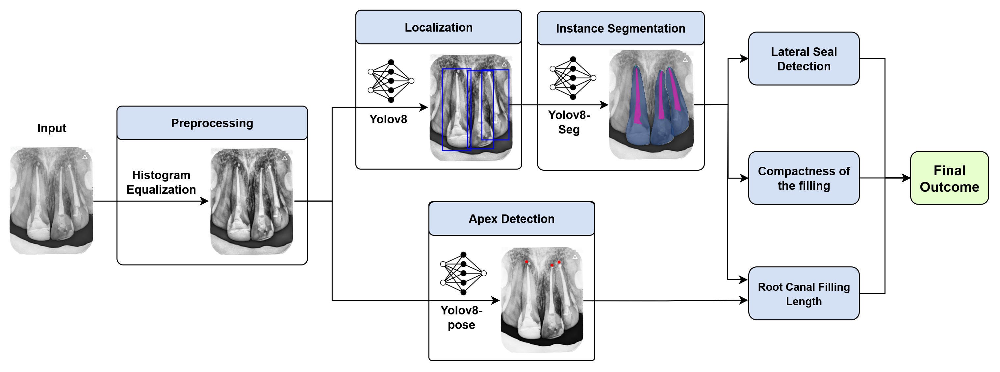

# AI-Assisted Tool for Assessing Quality of Final Root Canal Treatment Using Dental IOPA Radiographs

#### Team

- E/19/008, Chandula Adhikari, [e19008@eng.pdn.ac.lk](mailto:e19008@eng.pdn.ac.lk)
- E/19/009, Kaumini Adikari, [e19009@eng.pdn.ac.lk](mailto:e19009@eng.pdn.ac.lk)
- E/19/063, Sandeep Dassanayake, [e19063@eng.pdn.ac.lk](mailto:e19063@eng.pdn.ac.lk)

#### Supervisors

- Dr. I. Nawinne, [indika@eng.pdn.ac.lk](mailto:indika@eng.pdn.ac.lk)
- Prof. R.D. Jayasinghe, [rdjayasinghe@dental.pdn.ac.lk](mailto:rdjayasinghe@dental.pdn.ac.lk)
- Dr. R.M.S.G.K. Rasnayake, [rmsgk@dental.pdn.ac.lk](mailto:rmsgk@dental.pdn.ac.lk)
- Prof. R. Ragel, [rragel@eng.pdn.ac.lk](mailto:rragel@eng.pdn.ac.lk)
- Prof. M.C.N. Fonseka, [mcnf@eng.pdn.ac.lk](mailto:mcnf@eng.pdn.ac.lk)
- Dr. P.A. Hewage, [pahewage@eng.pdn.ac.lk](mailto:pahewage@eng.pdn.ac.lk)

#### Table of content

1. [Abstract](#abstract)
2. [Related works](#related-works)
3. [Methodology](#methodology)
4. [Experiment Setup and Implementation](#experiment-setup-and-implementation)
5. [Results and Analysis](#results-and-analysis)
6. [Conclusion](#conclusion)
7. [Publications](#publications)
8. [Links](#links)

---

## Abstract

We will develop an AI-based tool to automatically assess the quality of root canal treatments (RCTs) using intraoral periapical (IOPA) radiographs. Our solution aims to address the subjectivity and inconsistency in manual diagnosis by dental professionals. The tool will detect treated teeth, evaluate treatment adequacy (e.g., underfilled, overfilled, voids, separated instruments), and visually mark key anatomical features such as the root apex and pulp floor. We expect this system to assist clinicians in making reliable decisions while also providing a standardized platform for training and research.

---

## Related works

We analyzed prior work on:
- Automated tooth detection and segmentation in radiographs.
- Deep learning applications in dental diagnosis.
- Vision-language models (e.g., CLIP, BiomedCLIP) and medical segmentation models (e.g., MedSAM).
- Root canal treatment evaluation criteria and limitations in existing clinical assessment practices.

---

## Methodology

Our project consist of the following key components:
- **Data Collection**: We will collect a dataset of 1,000 anonymized IOPA radiographs from the Faculty of Dental Sciences.
- **Annotation**: Dental experts will annotate regions including treated teeth, canals, crowns, root apices, and potential voids.
- **Preprocessing**: Images will be enhanced using contrast normalization and artifact reduction techniques.
- **Model Architecture**:
  - Treated tooth localization using object detection (e.g., CenterNet).
  - Root canal region segmentation using transformer-based models (e.g., U-Net + ViT, MedSAM).
  - Keypoint detection for apex and pulpal floor mapping.
- **Labeling and Classification**: Using descriptive prompts and classifiers to determine RCT quality (e.g., overfilled, underfilled, etc.).

-  
      
    *Figure: Overview of the methodology pipeline.*

---

## Experiment Setup and Implementation

- We will use pre-trained models like **BiomedCLIP** for zero-shot classification and **MedSAM** for guided segmentation.
- Initial implementation will focus on binary classification: treated vs untreated.
- We will simulate and visualize feature embeddings using t-SNE/UMAP.
- Classifier accuracy will be benchmarked against expert assessments.
- For segmentation, we will evaluate precision, recall, IoU, and Dice score.

---

## Results and Analysis

We will evaluate:
- Accuracy of treated tooth detection (expected ≥90%).
- Classification performance across RCT conditions (overfilled, underfilled, voids, etc.).
- Effectiveness of visual overlays for clinical interpretability.
- Feedback from dental experts via a usability study.

---

## Conclusion

We aim to deliver a reliable AI-assisted diagnostic tool to support root canal treatment evaluation. Our project will improve diagnostic consistency, aid dental training, and pave the way for future integration with electronic dental records and mobile diagnostic apps.

---

## Publications

---

## Links

- [Project Repository](/cepdnaclk/e19-4yp-Quality-Assessment-of-Final-Root-Canal-Treatment-Using-Intra-Oral-Periapical-Radiographs/)
- [Project Page](https://cepdnaclk.github.io/e19-4yp-ai-assisted-rct-evaluation)
- [Department of Computer Engineering](http://www.ce.pdn.ac.lk/)
- [University of Peradeniya](https://eng.pdn.ac.lk/)

